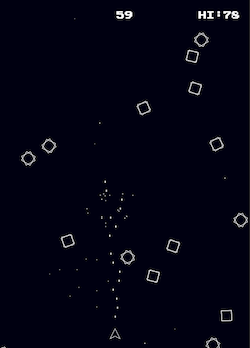

# shmup.re

In which I attempt to learn [ReasonML](https://facebook.github.io/reason) by making a simple canvas game. [Play it online](http://aaronfranks/shmup.re)

Admittedly, some of this code is pretty gnarly (it's my first Reason/Ocaml program). Feedback and
pull requests are welcome!

Also, if you want to make something similar, the [canvas2d bindings](https://github.com/BuckleTypes/bs-webapi-incubator/blob/master/src/gl/canvas2dRe.re) used here were extracted and merged into the [bs-webapi](https://github.com/BuckleTypes/bs-webapi-incubator) project.

## More Reason Resources

* [Official docs](https://facebook.github.io/reason)
* [An Introduction to Reason](https://kennetpostigo.gitbooks.io/an-introduction-to-reason/)
